# car-lease基于SpringBoot+Vue的汽车租赁系统的设计与实现

**有问题或获取源码可以咨询企鹅Q1760272627** 

**系统运行视频：**
https://www.bilibili.com/video/BV1Qj421R76Z/?vd_source=5f273f72fd3dc593e25c33cbccdad12e

### 功能：
用户：登录、注册、忘记密码、汽车信息、汽车租凭、汽车论坛、站内公告、在线咨询、我的收藏、故障申报、还车、个人中心

管理员：首页、汽车类型管理、汽车信息管理、租赁订单管理、还车管理、故障申报管理、维修管理、罚款信息、论坛管理、公告管理、咨询管理、用户管理、个人中心

### 采用技术：
SpringBoot，shiro，Mybatis-plus，Vue，redis，mysql，ElementUi，echarts

### 工具：
idea，vscode，navicat

### 系统截图：
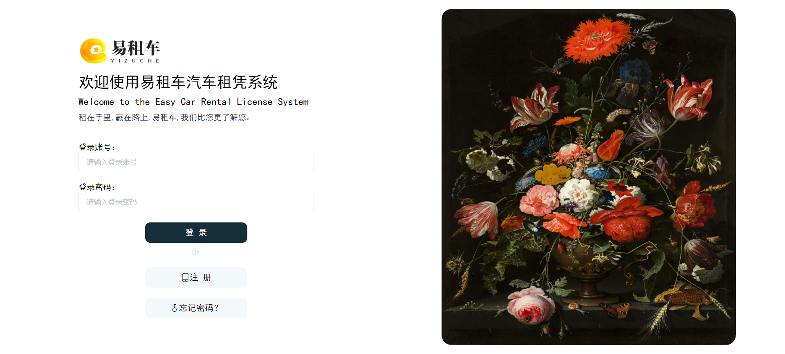
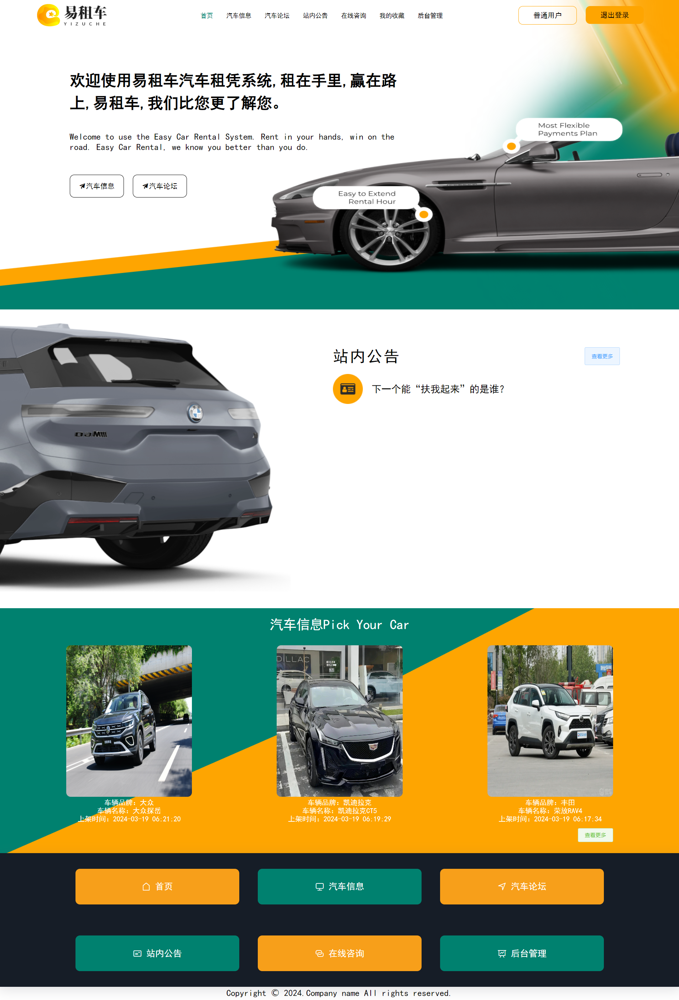
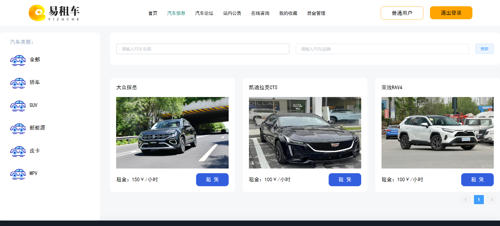
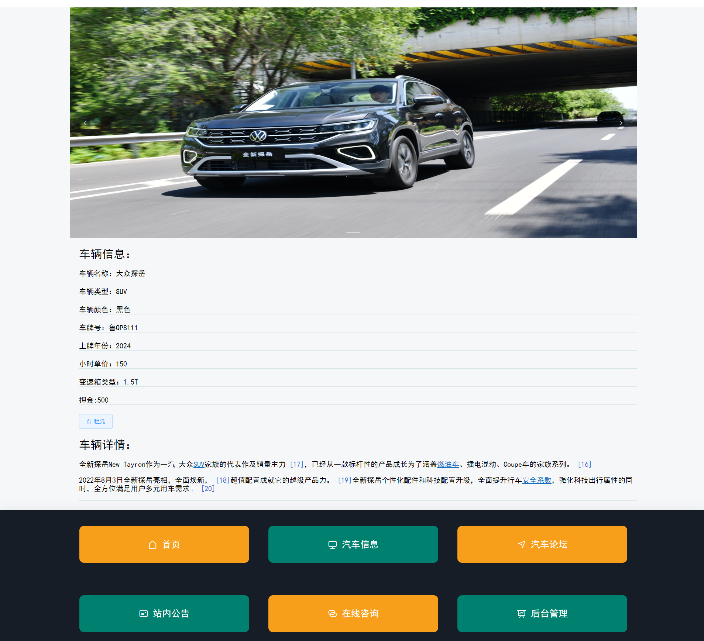
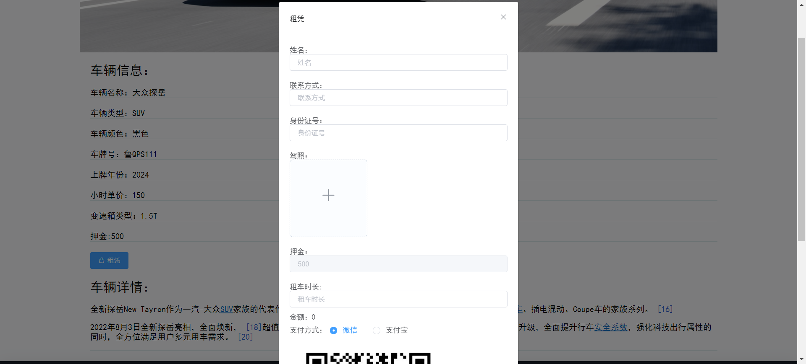
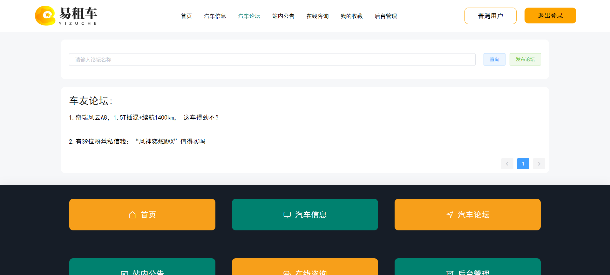
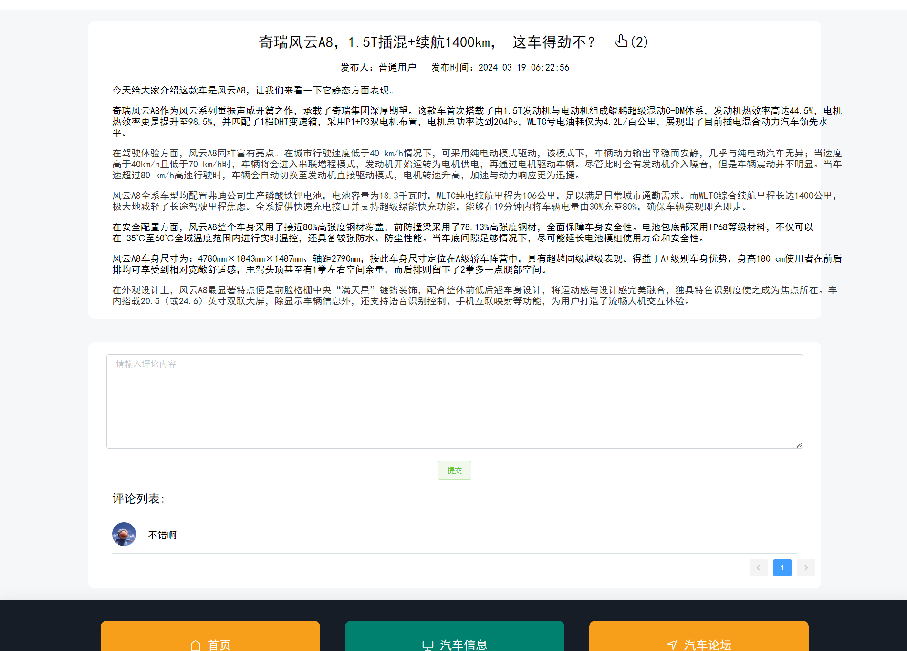
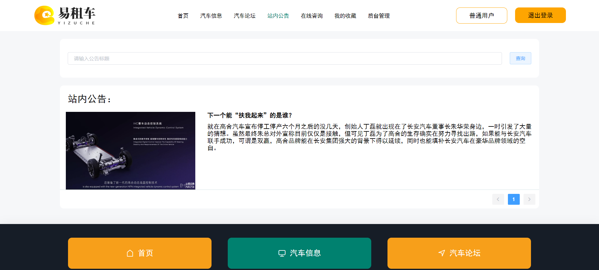
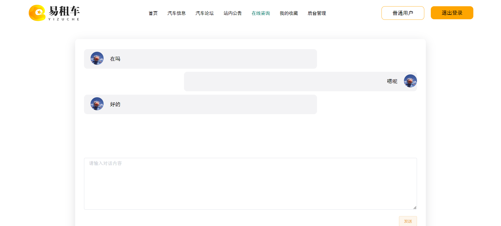
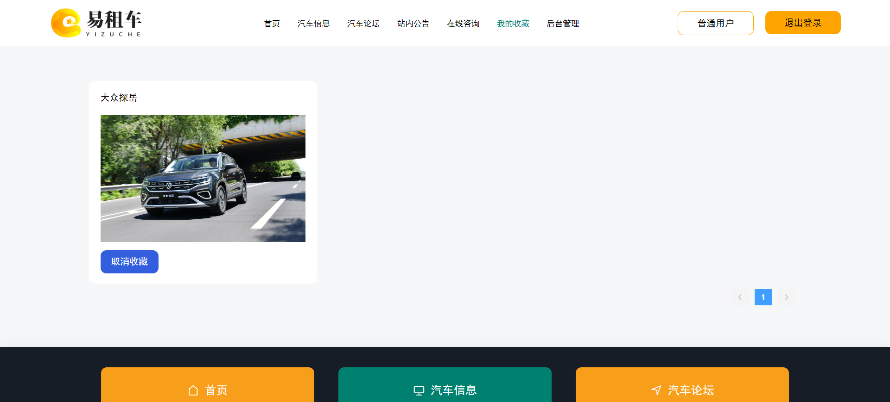
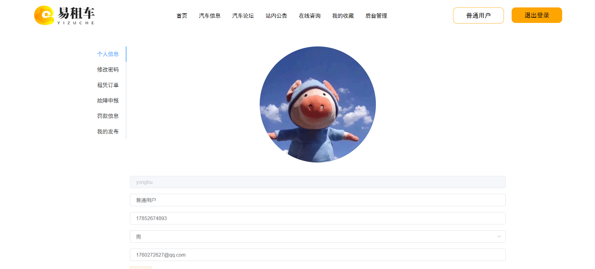
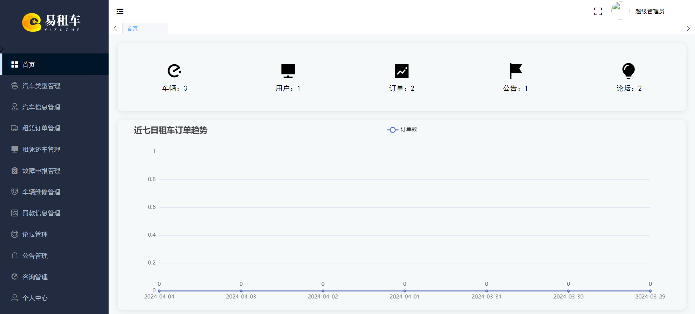

**有问题或获取源码可以咨询企鹅Q1760272627** 
